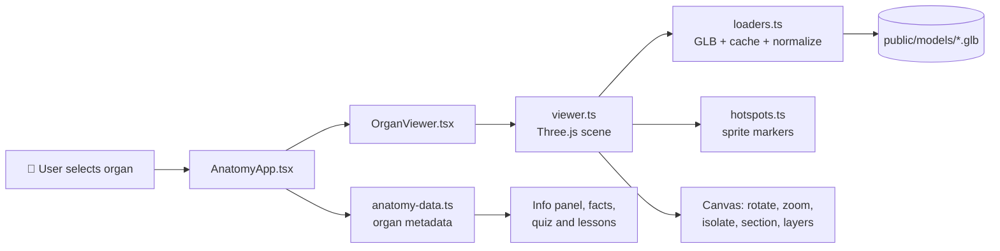

<div align="center">


# Anatomy Atelier <sup>✦</sup>

### *Learn anatomy like an artist.*

**An interactive 3D human anatomy museum that lives in your browser.**
Rotate real-time specimens, explore glowing hotspots, slice through layers, compare organs and test yourself, all inside a warm, editorial design.

<br/>

[](https://anatomy-atelier-zeta.vercel.app)

<br/>


<br/>

[**Overview**](#-overview) ·
[**Features**](#-features) ·
[**Organs**](#-the-organ-library) ·
[**How it works**](#-how-it-works) ·
[**Structure**](#-project-structure) ·
[**Quick start**](#-quick-start) ·
[**Deploy**](#-deployment) ·
[**Roadmap**](#-roadmap) ·
[**Credits**](#-credits)

</div>

---

## 🌸 Overview

Most anatomy resources feel like textbooks. **Anatomy Atelier** feels like walking through a gallery.

You pick an organ from a curated library, and it appears as a fully interactive 3D specimen. Drag to rotate it, scroll to zoom, click a glowing dot to learn what that part does. Beside it, a clean information panel gives you size, weight, location, blood supply, medical importance and a "Did you know" fact. Everything sits in a soft, paper-toned, serif-headed interface designed to make learning feel calm and beautiful.

> **The idea:** real-time 3D exploration + clean editorial UX + curated educational content = a learning tool that feels like a real product, not a demo.

---

## ✨ Features

<table>
<tr>
<td width="50%" valign="top">

### 🧬 Explore
- **9 detailed 3D organs** in one library
- **Drag-to-rotate, scroll-to-zoom** camera
- **Interactive hotspots** with floating labels
- **Auto-rotate** showcase toggle
- **Instant search** by organ or body system

</td>
<td width="50%" valign="top">

### 🛠️ Study tools
- **Isolate** a single organ
- **Cross-section** slicing via clipping planes
- **Layers** toggle
- **Compare mode** (e.g. Heart vs. Brain)
- **Reset view** in one click

</td>
</tr>
<tr>
<td width="50%" valign="top">

### 📚 Learn
- **Key facts**: size, weight, daily activity, location
- **Blood supply** and **medical importance**
- **Common conditions** and clinical notes
- **"Did you know"** highlights
- **View lesson** learning modals

</td>
<td width="50%" valign="top">

### 🎬 Engage
- **Function animations** showing how organs work
- **Quick quiz** right from the info panel
- **Microscopic view** cards
- **Smooth GSAP** transitions
- **Delayed loader** so loading never feels janky

</td>
</tr>
</table>

---

## 🫀 The Organ Library

| Organ | System | Highlights |
|:--|:--|:--|
| ❤️ **Heart** | Cardiovascular | The tireless pump, coronary blood supply, rhythm |
| 🧠 **Brain** | Nervous | Control center of the body |
| 🫁 **Lungs** | Respiratory | Gas exchange and breathing |
| 🟤 **Liver** | Digestive | Metabolism and detoxification |
| 🫘 **Kidneys** | Urinary | Filtration and fluid balance |
| 👁️ **Eye** | Sensory | Vision and light focusing |
| 🌀 **Intestine** | Digestive | Digestion and absorption |
| 🥜 **Pancreas** | Endocrine | Digestive enzymes and insulin |
| 🧴 **Skin** | Integumentary | Protection and regulation |

---

## 🖼️ Interface

```
┌─────────────────┬───────────────────────────────────┬──────────────────────┐
│  ORGAN LIBRARY  │         3D SPECIMEN VIEWER        │      INFO PANEL      │
│                 │                                   │                      │
│  🔍 Search      │   ┌───┐                           │  THE HEART           │
│  ─────────────  │   │ ⟲ │  Rotate                   │  The tireless pump   │
│  ❤️ Heart  ✓    │   │ 🔎 │  Zoom                    │                      │
│  🧠 Brain       │   │ ◌ │  Isolate      ✦ hotspot   │  KEY FACTS           │
│  🫁 Lungs       │   │ ▭ │  Cross-section            │  Size · Weight ·     │
│  🟤 Liver       │   │ ≡ │  Layers                   │  Location · Supply   │
│  🫘 Kidneys     │   │ ⬡ │  Compare                  │                      │
│  👁️ Eye         │   │ ↺ │  Reset                    │  [ View lesson → ]   │
│  🌀 Intestine   │   └───┘                           │  [ Animate ] [ Quiz ]│
│  …              │                                   │  [ Compare ]         │
└─────────────────┴───────────────────────────────────┴──────────────────────┘
        Microscopic view · Compare organs · Function animation · Clinical notes
```

---

## ⚙️ How It Works



**In plain words:**

1. **Data lives in one place.** `anatomy-data.ts` defines every organ: name, system, model path, facts, blood supply, medical notes, conditions, accent colors and hotspot coordinates.
2. **The UI reads that data.** `AnatomyApp.tsx` renders the library, info panel, modals and compare mode.
3. **The viewer renders the model.** `viewer.ts` runs the Three.js scene, camera controls, clipping and tools. `loaders.ts` loads each GLB, scales every model to a consistent size and caches it so switching organs is fast.
4. **Hotspots connect 3D to learning.** `hotspots.ts` draws floating sprite markers and handles visibility and selection.

<details>
<summary><b>🧩 Data model (simplified)</b></summary>

<br/>

Every organ follows one strongly typed shape, which keeps the UI and the 3D viewer in sync across all nine organs.

```ts
type OrganId =
  | "heart" | "brain" | "lungs" | "liver" | "kidneys"
  | "eyeball" | "intestine" | "pancreas" | "skin";

interface Hotspot {
  label: string;
  position: [number, number, number]; // point on the 3D model
}

interface Organ {
  id: OrganId;
  name: string;
  system: string;       // e.g. "Cardiovascular"
  model: string;        // path to the .glb file
  facts: Record<string, string>;
  bloodSupply: string;
  medicalNote: string;
  conditions: string[];
  accent: string;       // theme color
  hotspots: Hotspot[];
}
```

> This is a simplified illustration. See `app/lib/anatomy-data.ts` for the real definitions.

</details>

---

## 📁 Project Structure

```
anatomy-atelier/
│
├── 📂 app/
│   ├── 📂 components/
│   │   ├── AnatomyApp.tsx          # Main dashboard: organ library, modals, facts panel
│   │   └── OrganViewer.tsx         # 3D viewer wrapper + browser UI controls
│   │
│   ├── 📂 lib/
│   │   ├── anatomy-data.ts         # All organ metadata, hotspots, descriptions, facts
│   │   └── 📂 three/
│   │       ├── viewer.ts           # Core Three.js scene and interactive model logic
│   │       ├── hotspots.ts         # Hotspot sprites and selection behavior
│   │       ├── loaders.ts          # GLB loading, model normalization, caching
│   │       ├── dispose.ts          # Cleanup logic for 3D assets
│   │       └── tsl-materials.ts    # Material helpers for Three.js
│   │
│   ├── chatgpt-auth.ts             # Optional ChatGPT auth helpers
│   ├── globals.css                 # Global styling, app theme, layout system
│   ├── layout.tsx                  # Root layout, fonts, metadata
│   └── page.tsx                    # Root route entry, renders <AnatomyApp />
│
├── 📂 public/
│   ├── 📂 anatomy/                 # Organ thumbnails and illustrations
│   │   ├── brain/  eyeball/  heart/  intestine/  kidneys/
│   │   └── liver/  lungs/    pancreas/  skin/
│   ├── 📂 models/                  # 3D specimens (.glb)
│   │   ├── brain.glb      eyeball.glb   heart.glb
│   │   ├── intestine.glb  kidneys.glb   liver.glb
│   │   └── lungs.glb      pancreas.glb  skin.glb
│   ├── 📂 draco/                   # Draco mesh decompression
│   │   ├── draco_decoder.js
│   │   └── draco_wasm_wrapper.js
│   └── 📂 basis/
│       └── basis_transcoder.js     # Basis texture support
│
├── 📂 worker/
│   └── index.ts                    # Cloudflare Worker entry point
│
├── 📂 build/
│   └── sites-vite-plugin.ts        # Vinext / Cloudflare build plugin support
│
├── 📂 db/
│   ├── index.ts                    # Drizzle + Cloudflare D1 connection helper
│   └── schema.ts                   # Scaffolded database schema
│
├── 📂 drizzle/
│   └── meta/_journal.json          # Drizzle migration metadata
│
├── 📂 examples/
│   └── d1/                         # Example D1 CRUD API (notes) and schema
│
├── 📂 tests/
│   └── rendered-html.test.mjs      # Build and render verification tests
│
├── 📂 .openai/
│   └── hosting.json                # Hosting / Cloudflare config
│
├── drizzle.config.ts               # Drizzle config
├── eslint.config.mjs               # Linting rules
├── next.config.ts                  # Next.js config
├── postcss.config.mjs              # PostCSS / Tailwind
├── tsconfig.json                   # TypeScript config
├── vercel.json                     # Vercel config
├── vite.config.ts                  # Vinext / Vite config
└── package.json
```

---

## 🧰 Tech Stack

| Layer | Technology |
|:--|:--|
| **Framework** | Next.js 16, React 19, TypeScript |
| **3D engine** | Three.js with a custom viewer, GLB models, Draco and Basis compression |
| **Animation** | GSAP |
| **Styling** | Tailwind CSS 4, with a custom editorial design language |
| **Icons** | Lucide React |
| **Runtime** | Vinext, Vite 8, Cloudflare Workers |
| **Database** | Drizzle ORM + Cloudflare D1 *(scaffolded for future use)* |
| **Testing** | Node test runner |
| **Hosting** | Vercel |

---

## 🚀 Quick Start

### Prerequisites

- **Node.js ≥ 22.13**
- **npm**

### Run locally

```bash
# 1. Clone
git clone https://github.com/luckyfaizu3-eng/anatomy-atelier.git

# 2. Enter the project
cd anatomy-atelier

# 3. Install dependencies
npm install

# 4. Start the dev server
npm run dev
```

Then open **http://localhost:3000** 🎉

### Scripts

| Command | Description |
|:--|:--|
| `npm run dev` | Start the Vinext dev server |
| `npm run build` | Production build for Cloudflare (Vinext) |
| `npm run build:next` | Standard Next.js build (used on Vercel) |
| `npm run start` | Serve the production build |
| `npm run lint` | Lint with ESLint |
| `npm test` | Build and run rendered-HTML tests |
| `npm run db:generate` | Generate Drizzle migrations |

<details>
<summary><b>🪟 Troubleshooting on Windows</b></summary>

<br/>

**`'WRANGLER_LOG_PATH' is not recognized...`**
Windows does not understand `VAR=value command`. This project uses [`cross-env`](https://www.npmjs.com/package/cross-env) in its scripts, so run `npm install` first and it works on Windows, macOS and Linux.

**3D model stuck on "Preparing…"**
Wait a few seconds on the first load (GLB files are large), then hard refresh with `Ctrl + Shift + R`. Open DevTools → Network and confirm `*.glb` files return `200`.

**`git push` fails with "remote end hung up unexpectedly"**
```bash
git config --global http.postBuffer 524288000
```

</details>

---

## ☁️ Deployment

### ▲ Vercel

| Setting | Value |
|:--|:--|
| Framework Preset | `Next.js` |
| Build Command | `npm run build:next` |
| Install Command | `npm install` |
| Node.js Version | `22.x` |

Push to `main` and Vercel deploys automatically.

### ☁ Cloudflare Workers

Hosting config is included (`.openai/hosting.json`, `vite.config.ts`, `worker/index.ts`). Use `npm run build` for the Cloudflare-targeted build.

---

## 🗺️ Roadmap

- [x] 3D viewer with rotate, zoom and hotspots
- [x] Search, compare mode and learning modals
- [x] Isolate, cross-section and layers tools
- [x] Live deployment on Vercel
- [ ] User accounts and saved notes (D1 database)
- [ ] More organs and full body systems
- [ ] Larger quiz bank with scoring and progress
- [ ] Guided lessons with 3D camera tours
- [ ] Mobile touch-gesture polish
- [ ] Multi-language support (English, Urdu, Hindi)

---

## ⚠️ Disclaimer

Anatomy Atelier is made **for educational purposes only**. It is not a medical device and must not be used for diagnosis or treatment. Always consult a qualified healthcare professional for medical advice.

---

## 👥 Credits

<div align="center">

| | |
|:--:|:--:|
| 👑 **Owner** | 💻 **Developed by** |
| **Rasiq Gulzar** | **Faizan Tariq** |
| *Vision & ownership* | *Development & deployment* |

</div>

---

## 📄 License

Add your preferred license (for example MIT) and include a `LICENSE` file in the repository.

---

<div align="center">

### ⭐ If Anatomy Atelier helped you learn something, give it a star!

**[🌐 Open the Live Demo](https://anatomy-atelier-zeta.vercel.app)**

<sub>Made with ❤️ by <b>Faizan Tariq</b> · Owned by <b>Rasiq Gulzar</b></sub>

</div>
